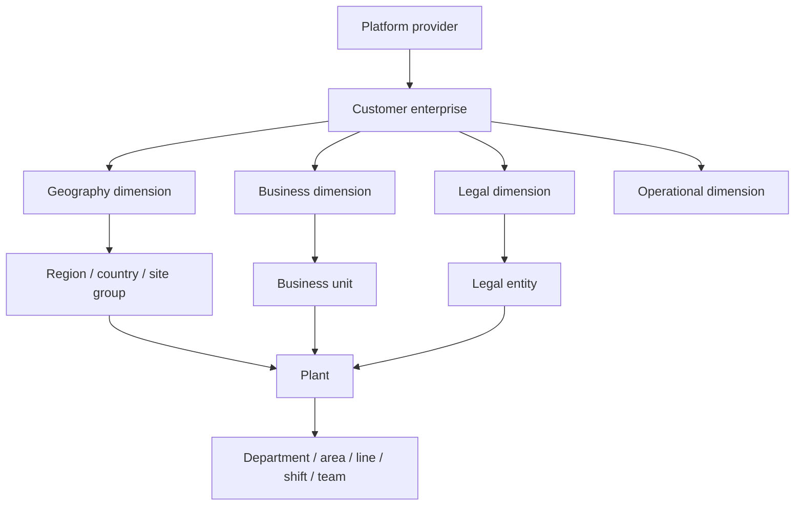

# Global Enterprise Architecture

## Purpose

Version 2 adds a global-enterprise authorization layer between the SaaS
platform operator and each customer's companies, plants, and operational
records. Existing company, plant, module, dashboard, and runtime APIs remain in
place. The new layer adds explicit enterprise membership, parallel hierarchy
dimensions, scoped role assignments, classifications, and centrally evaluated
access.

The Version 1 repository remains a read-only reference and is not changed by
this implementation.

## Architecture assessment

Before this change, Version 2 had:

- tenant, company, plant, warehouse, department, user, role, and module data;
- legacy role checks and user-assigned module visibility;
- company feature flags and company-scoped runtime queries;
- canonical lazy-loaded dashboard routes and React Query cache isolation;
- supplier/customer portals and audit records.

The limiting assumptions were one legacy role per user, company-first scope,
and no safe representation of a plant in multiple geographic, business, and
legal structures. The new model is additive. Legacy roles continue to work
through explicit compatibility role templates and assignments.

## Layering



A plant can therefore be a descendant of APAC in the geography dimension,
Automotive Components in the business dimension, and a specific legal entity
in the legal dimension without duplicating the plant.

## Core data model

| Entity | Purpose |
|---|---|
| `enterprises` | Customer-enterprise boundary linked to an existing tenant. |
| `enterprise_memberships` | A user's identity and status inside one enterprise. |
| `organizational_nodes` | Typed scope nodes from enterprise through team. |
| `organizational_relationships` | Dimension-specific parent/child edges. |
| `role_templates` | Configurable platform, global, regional, site, frontline, and external roles. |
| `role_capabilities` | `resource.action` capabilities attached to templates. |
| `user_role_assignments` | Scope, descendants, domains, modules, classifications, ownership, dates, delegator, and status. |
| `user_access_overrides` | Explicit user allow/deny exceptions; deny wins. |
| `module_entitlements` | Enterprise-level module availability. |
| `data_classification_policies` | Resource classification and hidden/masked fields. |
| `temporary_access_grants` | Governed record for assignments with an expiry. |
| `support_access_sessions` | Explicit, time-limited, revocable platform support access. |
| `scope_bookmarks` | Recently used and saved scopes. |
| `enterprise_audit_events` | Security and administration event history. |

All enterprise-owned rows carry an enterprise identifier. Common hierarchy,
assignment, capability, and time-window lookups are indexed. Relationships and
role assignments use foreign keys and stable IDs.

## Scope model

Normalized scopes are:

`platform`, `enterprise`, `legal_entity`, `business_unit`, `region`,
`country`, `site_group`, `plant`, `warehouse`, `department`, `area`, `line`,
`shift`, and `team`.

Legacy mapping:

| Existing term | Enterprise meaning |
|---|---|
| tenant | SaaS customer boundary; linked one-to-one to the seeded enterprise |
| client/company | legal entity or customer-company record, depending on the existing route |
| plant | plant organizational node linked by `source_entity_id` |
| department | operational department node |
| company feature flag | source for initial enterprise module entitlement |
| legacy role | compatibility template plus explicit scoped assignment |

The API does not rename existing `client` fields blindly. New endpoints use
enterprise and node terminology while old endpoints retain their contracts.

## Authorization evaluation

`app/authorization.py` is the central evaluator. A protected request is
allowed only after the following intersections:

```text
tenant/enterprise boundary
AND active enterprise membership
AND active scoped assignment
AND scope ancestry or exact scope
AND functional domain
AND role capability
AND module assignment and module entitlement
AND dashboard/module permission
AND data classification
AND record ownership
AND assignment validity dates
AND user overrides
```

Evaluation order is intentionally fail-closed. Explicit deny overrides any
role allow. Expired assignments stop granting access immediately. A read-only
role cannot mutate even when it has a broad scope. Inaccessible records return
a safe denial or not-found response without identifying the hidden object.

`app/enterprise_guards.py` applies this evaluator to existing `ModuleRecord`
queries and mutations. It translates modules such as `reports` to their
functional domain (`analytics`) and scopes SQL queries to allowed company and
plant IDs before execution.

## Platform and enterprise administration

`platform_super_admin` is a SaaS operator role. It can provision tenants,
modules, infrastructure, platform settings, and support access. It has no
automatic customer operational or personal-data access.

`enterprise_global_owner` is the highest role inside one customer enterprise.
It can inherit that enterprise's descendants but cannot cross to another
enterprise.

A platform support user must create a support session with:

- enterprise and scope;
- reason;
- start and expiry;
- delegated permissions;
- visible acting-as state;
- audit record;
- revocation.

## Role families

The seed includes:

- Platform: super admin, support admin, security admin, auditor.
- Enterprise: owner, admin, executive, operations, quality, maintenance,
  supply-chain, procurement, finance, compliance, and IT/data directors.
- Regional/business: regional director, country manager, business-unit
  director, site-group manager, and multi-site operations manager.
- Site: plant, production, quality, maintenance, warehouse, planning,
  procurement, department, area, shift, and team leadership.
- Frontline: operator, technician, inspector, warehouse operator, maintenance
  technician, and quality inspector.
- External/read-only: auditor, supplier, customer, and contractor.
- Compatibility: scoped administrator, custom scoped role, and basic assigned
  user.

Roles are templates. Access comes from assignments, not the role name alone.
A user may hold multiple assignments over different scopes and date windows.

## Data classification

Supported classifications are `public`, `internal`, `confidential`,
`restricted`, `personal`, `financial`, `security_sensitive`, and
`medical_or_safety_sensitive`.

The first four form an increasing general sensitivity ladder. Personal,
financial, security, and medical/safety classifications are special categories
that require explicit assignment. They are not inferred from general
confidential access. Policies can hide fields or return masked values. Auditors
with personal-data access receive masked output because their template is
read-only.

## Frontend behavior

`EnterpriseAccessContext` is the single frontend consumer of backend effective
access. It exposes active enterprise/scope state, capabilities, modules,
navigation, and context switching.

On scope change it:

1. cancels active scoped queries;
2. removes prior-scope cached data;
3. validates the requested scope against backend-provided scopes;
4. persists the user's current context;
5. recalculates navigation and route access;
6. renders the new scope only after access resolves.

Navigation is generated from `GET /users/{id}/navigation`. The app hides
inaccessible pages and guards manually edited URLs. Frontline users receive a
work-focused navigation. Enterprise, regional, business-unit, and plant users
receive scope-appropriate navigation.

The persistent scope selector supports search, recent scopes, and only
backend-authorized choices. `EnterpriseContextIndicator` shows the enterprise,
scope, data date, currency, timezone, and consolidation rule.

Canonical dashboards remain lazy loaded. Added dashboard keys include global
executive, global operations, global quality, global supply chain, global
maintenance, regional, country, business unit, multi-site, plant command
center, department, shift, and frontline views.

## Administration UI

`/admin/enterprise` provides:

- enterprise structure and node search;
- parallel geography, business, legal, and operational relationships;
- role templates;
- searchable enterprise members;
- scoped role assignment and revocation;
- descendant and expiry controls;
- module entitlements;
- data access policies;
- temporary and support access;
- enterprise audit;
- human-readable permission explanation.

The platform support entry point is shown separately and requires a reason and
expiry before entering a customer context.

## API surface

The enterprise router implements:

- enterprise list, create, detail, hierarchy, members, and dashboard;
- hierarchy node create/update/deactivate;
- hierarchy relationship create/delete;
- role template list/create/update;
- role assignment list/create/update/revoke;
- effective access, available scopes, navigation, and permission explanation;
- support session create/revoke/list;
- module entitlement list/update;
- data policy list/create/update;
- temporary access list;
- enterprise audit list.

Existing runtime APIs are preserved and protected by the same evaluator where
they query or mutate shared module records.

## Query and dashboard ownership

Enterprise query keys include enterprise, scope type, scope ID, module,
dashboard, date range, currency, and timezone where relevant. The backend owns
authorization and aggregation. The frontend owns display state, query
cancellation, breadcrumbs, loading/empty/error handling, and lazy component
loading.

## Security assumptions

- JWT authentication remains the identity transport.
- PostgreSQL is the production metadata store.
- All protected IDs are revalidated against enterprise and scope ownership.
- Credentials and secrets are not returned by enterprise APIs.
- External identities must match their external organization ownership rule.
- Support impersonation is never implicit.
- Audit events are append-only at the application layer.

## Known limitations

- Enterprise hierarchy CRUD is implemented in the existing modular monolith,
  not a separate authorization service.
- Comparison uses normalized record counts and quantities; advanced unit and
  currency conversion requires future master-data rates.
- Scope bookmarks are modeled but the first UI emphasizes recent/current
  context.
- Database row-level security is not enabled; authorization is enforced by the
  application evaluator and scoped repository queries.
- Existing non-`ModuleRecord` module packages retain their established guards;
  migration to the central evaluator should continue incrementally.

