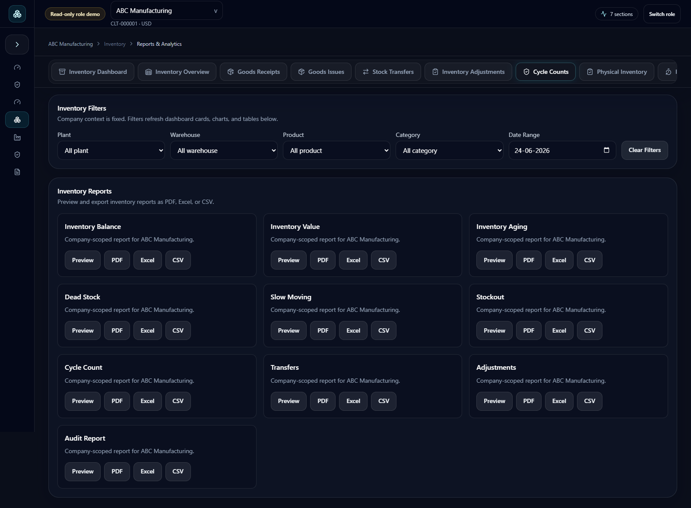
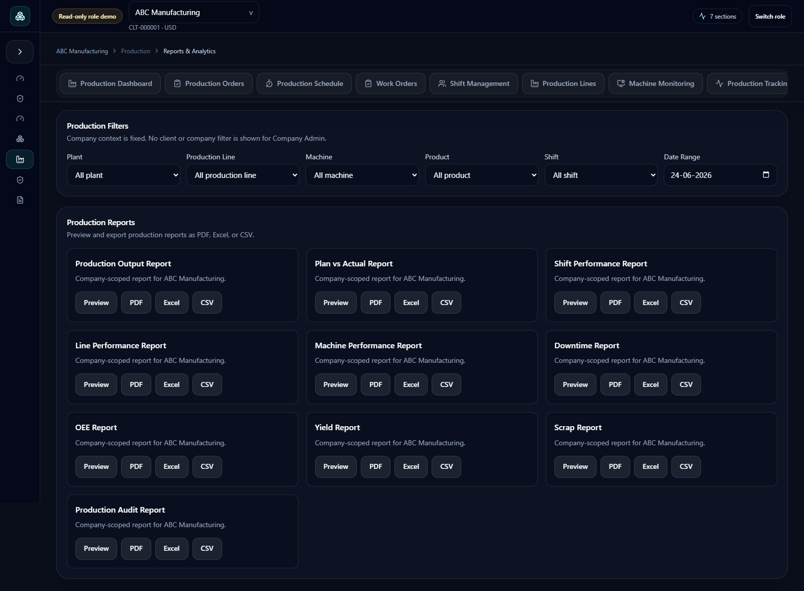

# Version 2 Current Role and Route Validation

Validation date: 15 July 2026  
Application: Metam Services Version 2  
Validated image: `vinodreddy1999/metam-services-v2-fullstack:2.0.0-beta.4`  
Local URL: `http://localhost:18080`

## Current conclusion

The earlier broad `Loading workspace view` problem is resolved in the current Version 2 container. A real Chrome sweep completed without application errors across:

- all 11 passwordless demo roles;
- all 8 Super Admin platform workspaces;
- 104 client-context dashboard, admin, module, and module sub-screen routes;
- Inventory Reports and Production Reports specifically.

The reported `ERR_BLOCKED_BY_CLIENT` result on `/inventory/reports` and `/production/reports` is not produced by Metam Services. It is a restriction from the inspection client that attempted to open those URLs. Both routes render normally through Chrome against the local Docker deployment.

## Report route evidence

### Inventory Reports

- Requested: `/inventory/reports`
- Rendered: `/inventory/reports`
- Expected heading: `Inventory Reports`
- Console errors: 0
- Page errors: 0
- Failed requests: 0
- HTTP 4xx/5xx responses: 0

### Production Reports

- Requested: `/production/reports`
- Rendered: `/production/reports`
- Expected heading: `Production Reports`
- Console errors: 0
- Page errors: 0
- Failed requests: 0
- HTTP 4xx/5xx responses: 0

## Test method

The sweep used the production Docker image and an installed Google Chrome browser at a 1600 x 1000 desktop viewport. Each route was opened through React Router navigation after a real passwordless role login. The check failed a route if it found any of the following:

- `ERR_BLOCKED_BY_CLIENT`;
- `Loading workspace view` remaining on screen;
- an application or dashboard error state;
- a browser console error;
- an unhandled page error;
- a failed network request;
- an HTTP 4xx or 5xx response.

## Role sweep

| Role | Session user selected by the live demo | Visible navigation result |
|---|---|---|
| Super Admin | `super.apx@metam.local` | Pass |
| Account Owner | `owner.apx@metam.local` | Pass |
| Organization Admin | `orgadmin.apx@metam.local` | Pass |
| Admin | `admin.abcmanufacturing@metam.local` | Pass |
| Team Manager | `manager.abcmanufacturing@metam.local` | Pass |
| Supervisor | `supervisor.abcmanufacturing@metam.local` | Pass |
| Operator | `operator.abcmanufacturing@metam.local` | Pass |
| Auditor | `auditor.abcmanufacturing@metam.local` | Pass |
| QA Tester | `qa.apx@metam.local` | Pass |
| Custom User | `custom.apx@metam.local` | Pass |
| Standard User | `user.apx@metam.local` | Pass |

Result: **11 of 11 roles passed** their visible navigation with no browser or network errors.

The role-preview API currently displays `scale.admin.vinod@metam.local` for Admin and `viewer.nova@metam.local` for Standard User in both Version 1 and Version 2. They are enterprise scale-data identities, not a Version 2-only change. Passwordless login selects an active account for the requested role; role permissions and read-only enforcement come from the role claim, not from the displayed preview email.

## Super Admin platform sweep

The following embedded Platform View workspaces passed:

1. Platform overview
2. Clients
3. Users
4. Modules
5. Subscriptions
6. Integrations
7. Audit
8. Business impact

Result: **8 of 8 platform workspaces passed**.

## Client route sweep

After selecting ABC Manufacturing, the sweep exercised 104 routes covering:

- unified dashboards;
- company administration and settings;
- Data Hub, performance, operations, and intelligence;
- Planning and every Planning sub-screen;
- Inventory and every Inventory sub-screen;
- Warehouse and every Warehouse sub-screen;
- Production and every Production sub-screen;
- Maintenance and every Maintenance sub-screen;
- Quality, Procurement, Sales, Costing, Compliance, Customer Portal, Supplier Portal, and Documents.

Result: **104 of 104 routes completed without browser, page, request, or HTTP errors**.

Inventory, Planning, and Production report screens rendered directly. Warehouse and Maintenance report URLs redirected to the first permitted dashboard because those modules are not enabled for the selected ABC client. That redirect is expected RBAC behavior, not a route failure.

## Repair made during this sweep

The Organization Admin executive dashboard was silently requesting Admin and Data Hub APIs that the backend does not authorize for that role. The UI rendered, but Chrome recorded three hidden 403 responses. Version 2 now:

- avoids Admin/Data Hub queries unless the role can call those APIs;
- hides Data Hub navigation for Organization Admin;
- keeps Company Profile, dashboard, assigned modules, and intelligence access unchanged;
- shows no backend permission errors on the Organization Admin dashboard.

## Remaining validation boundary

The public role switcher is intentionally read-only. This sweep validates rendering, navigation, RBAC redirects, lazy chunks, and read APIs. Destructive create, update, delete, import, approval, and password-reset workflows require a separate authenticated write-enabled QA run and are not claimed as covered here.
