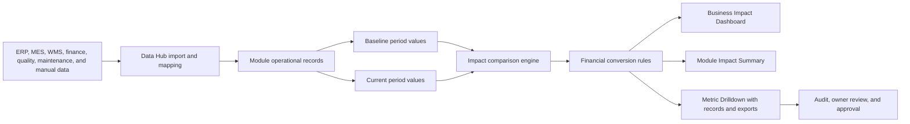
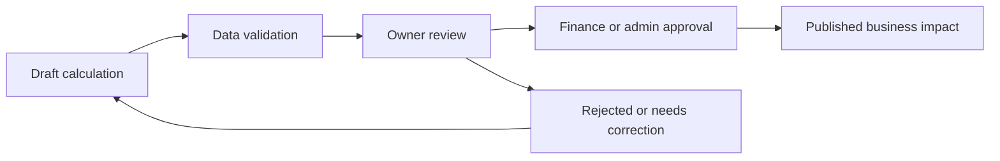

# Metam Services Business Impact and Savings Methodology

## Purpose

This document explains how the Metam Services platform shows money saved, cost avoided, time saved, operational improvement, and business impact across manufacturing modules.

The goal is simple: when a client uses the platform, we compare how the operation performed before and after improvement, convert measurable operational gains into business value, and show the result in dashboards, module summaries, drilldowns, and exports.

The current Version 2.0 application already has a Business Impact model in the frontend. The current values are calculation-ready simulated data until live backend impact APIs and finance-approved source data are connected.

## Executive Summary

Metam Services saves money in four main ways:

| Saving type | Plain meaning | Example |
|---|---|---|
| Direct cost reduction | Actual operating cost goes down | Lower material cost, labor cost, scrap cost, logistics cost |
| Cost avoidance | Future losses are prevented | Avoided stockouts, avoided downtime, avoided penalties |
| Working capital release | Less cash is locked in inventory or slow-moving stock | Inventory reduced without hurting production |
| Productivity and time savings | People, machines, and processes complete work faster | Faster receiving, faster approvals, less manual data entry |

The application does not only say "money saved". It also shows what changed, where it changed, who owns it, what records contributed to it, and whether the improvement is completed or still an opportunity.

## Current Implementation Source

The savings model is currently implemented in these frontend files:

| Area | File |
|---|---|
| Module impact definitions and generated metrics | `frontend/src/impact/data.ts` |
| Calculation formulas | `frontend/src/impact/calculations.ts` |
| Impact data types | `frontend/src/impact/types.ts` |
| Business impact dashboard | `frontend/src/pages/BusinessImpactDashboard.tsx` |
| Module-level impact section | `frontend/src/impact/components/ModuleImpactSummary.tsx` |
| Metric drilldown and exports | `frontend/src/impact/components/ImpactDrilldown.tsx` |

## Data Flow



## How Comparison Works

Each impact metric has:

| Field | Meaning |
|---|---|
| Previous period | Baseline period, currently shown as Q1 2026 |
| Current period | Latest comparison period, currently shown as Q2 2026 |
| Previous value | Before value |
| Current value | After value |
| Difference | Current value minus previous value |
| Percentage change | Difference divided by previous value |
| Improvement rule | Whether increase or decrease is considered good |
| Financial impact | Positive business value created from the improvement |
| Status | Improved, Declined, or No Change |

### Core formulas

```text
difference = current_value - previous_value

percentage_change = ((current_value - previous_value) / abs(previous_value)) * 100

if higher is better:
  improvement = current_value - previous_value

if lower is better:
  improvement = previous_value - current_value

financial_impact = max(0, improvement * value_per_unit)
```

### Status rules

| Rule | Status |
|---|---|
| Metric moved in the good direction | Improved |
| Metric moved in the bad direction | Declined |
| Metric did not materially change | No Change |

Examples:

| Metric | Good direction | Before | After | Result |
|---|---:|---:|---:|---|
| Downtime reduction | Lower is better | 62 hours | 56 hours | Improved |
| Inventory accuracy improvement | Higher is better | 94% | 98% | Improved |
| Failed sync reduction | Lower is better | 82 failures | 65 failures | Improved |
| Gross margin improvement | Higher is better | 18% | 21% | Improved |

## Rollup Calculations Shown in the Dashboard

The Business Impact Dashboard shows four primary rollups:

| Dashboard value | How it is calculated today |
|---|---|
| Total money saved | 64% of total positive financial impact |
| Total cost avoided | 36% of total positive financial impact |
| Total time saved | Sum of time-related metric movement multiplied by the current time conversion factor |
| Efficiency improvement | Average absolute percentage change across improved percentage metrics |

The 64% money saved and 36% cost avoided split is a presentation model in the current simulated implementation. In production, this should be replaced by finance-approved saving category mapping for each metric.

## Savings Categories Used by the Application

### 1. Direct Money Saved

Direct money saved means a cost actually reduced. It can be seen in categories such as:

| Area | Example savings |
|---|---|
| Inventory | Dead stock reduction, slow-moving stock reduction, carrying cost reduction |
| Production | Scrap reduction, rework reduction, production cost saved |
| Maintenance | Maintenance cost saved, emergency repair reduction |
| Quality | Scrap money saved, quality cost saved |
| Procurement | Purchase price variance improvement, emergency purchase reduction |
| Costing | Material cost, labor cost, machine cost, energy cost, logistics cost reduction |

### 2. Cost Avoided

Cost avoided means the platform helped prevent a likely future loss.

| Area | Example avoided cost |
|---|---|
| Inventory | Stockout reduction, expired stock prevention |
| Maintenance | Downtime cost avoided, breakdown reduction |
| Quality | Complaint reduction, audit issue reduction |
| Compliance | Penalty risk avoided, non-compliance reduction |
| Procurement | Expedited cost avoided, supplier delay risk reduction |

### 3. Working Capital Released

Working capital release means money is no longer unnecessarily locked in inventory.

Common sources:

| Metric | Meaning |
|---|---|
| Inventory value reduction | Less cash locked in stock |
| Dead stock reduction | Unused inventory is cleared or avoided |
| Slow-moving stock reduction | Slow-moving stock is reduced or transferred |
| Better reorder accuracy | Less overbuying and fewer emergency buys |

Example:

```text
Before inventory value = INR 1,200,000
After inventory value = INR 1,000,000
Working capital released = INR 200,000
Annual carrying cost rate = 18%
Annual carrying cost saving = INR 36,000
```

### 4. Time Saved

Time saved is calculated from operational cycle time, lead time, response time, approval time, and manual work reduction.

| Area | Example |
|---|---|
| Warehouse | Receiving time reduction, dispatch time reduction, material handling time reduction |
| Procurement | RFQ cycle time reduction, PO approval time reduction |
| Maintenance | Maintenance response time reduction, MTTR improvement |
| Admin | User onboarding time reduction, approval time reduction |
| Data Hub | Data import time reduction, manual data entry reduction |

### 5. Efficiency Improvement

Efficiency improvement means better use of people, machines, inventory, plants, and systems.

| Area | Example |
|---|---|
| Production | OEE improvement, throughput improvement, capacity utilization |
| Planning | Plan accuracy, workforce utilization, production plan adherence |
| Warehouse | Space utilization, picking accuracy, bin utilization |
| Data Hub | Data freshness, reconciliation accuracy, mapping completion |

### 6. Revenue Protected

Revenue protected means the application helps prevent order loss, late delivery, customer dissatisfaction, or dispatch failure.

| Area | Example |
|---|---|
| Sales and Distribution | Order fulfillment improvement, delivery delay reduction, order backlog reduction |
| Inventory | Stockout reduction |
| Production | Schedule adherence improvement |
| Warehouse | Dispatch readiness and picking accuracy |

### 7. Compliance and Risk Reduction

Compliance value is normally measured as avoided penalty risk, fewer audit issues, faster approvals, and better evidence readiness.

| Area | Example |
|---|---|
| Compliance | Audit findings reduction, document approval time reduction |
| Documents | Expired document reduction, version conflict reduction |
| Quality | CAPA closure improvement, NCR reduction |
| Admin | Audit issue reduction, permission issue reduction |

### 8. Data and Integration Savings

Data savings come from reducing manual work and improving trust in connected systems.

| Metric | Business value |
|---|---|
| Manual data entry reduction | Less admin effort and fewer human errors |
| Sync success rate improvement | More reliable automated data movement |
| Failed sync reduction | Less rework and fewer broken dashboards |
| Data import time reduction | Faster reporting and operational decisions |
| Duplicate data reduction | Cleaner reports and fewer reconciliation errors |

## Module Categories and Impact Metrics

The current application defines impact coverage for these modules.

| Module | Business output categories | Example metrics used |
|---|---|---|
| Inventory | Money saved, working capital released, days of stock improved, inventory turnover improvement | Inventory value reduction, carrying cost reduction, dead stock reduction, slow-moving stock reduction, stockout reduction, inventory accuracy improvement |
| Production | Extra units produced, lost hours avoided, production cost saved, throughput improvement | Output increase, plan vs actual improvement, OEE, downtime reduction, capacity utilization, schedule adherence, scrap reduction, rework reduction |
| Maintenance | Downtime cost avoided, maintenance cost saved, asset uptime gained, emergency repair reduction | Downtime reduction, breakdown reduction, preventive maintenance compliance, work order closure, spare parts cost, asset availability, MTTR, MTBF |
| Quality | Quality cost saved, scrap money saved, customer complaint reduction, compliance improvement | Defect reduction, rejection reduction, scrap cost reduction, rework cost reduction, inspection pass rate, CAPA closure, NCR reduction |
| Procurement | Purchase cost saved, lead time days saved, better supplier performance, expedited cost avoided | Purchase price variance, vendor lead time, on-time delivery, supplier quality, RFQ cycle time, PO approval time, material shortage, emergency purchase |
| Sales and Distribution | Revenue protected, logistics cost saved, delivery time saved, customer service improvement | Order fulfillment, delivery delay, dispatch efficiency, logistics cost, revenue increase, backlog reduction, customer complaint reduction |
| Costing and Profitability | Margin improved, cost per unit saved, profit increase, loss-making product identification | Material cost, labor cost, machine cost, energy cost, logistics cost, cost per unit, gross margin, product profitability, customer profitability, plant profitability |
| Planning | Planning error reduced, better resource utilization, fewer shortages, fewer excesses | Plan accuracy, demand variance, capacity plan accuracy, procurement plan accuracy, production plan adherence, inventory plan adherence, workforce utilization |
| Warehouse | Warehouse cost saved, labor hours saved, faster movement, better stock accuracy | Space utilization, picking accuracy, receiving time, dispatch time, cycle count accuracy, bin utilization, material handling time |
| Compliance | Compliance risk reduced, audit readiness improved, penalty risk avoided, faster approvals | Audit findings, compliance score, document approval time, electronic signature completion, non-compliance, corrective action closure |
| Customer Portal | Support workload reduced, customer satisfaction improved, faster query resolution | Self-service usage, support ticket reduction, order visibility, invoice query reduction, delivery query reduction, response time |
| Supplier Portal | Procurement cycle improved, supplier communication improved, manual follow-up reduced | Supplier response time, RFQ response, PO acknowledgement time, delivery update, supplier document completion, supplier dispute reduction |
| Integration Hub | Admin time saved, data errors reduced, faster data availability, integration reliability improved | Manual data entry reduction, sync success rate, failed sync reduction, data import time, integration uptime, duplicate data reduction |
| Manufacturing Data Hub | Cleaner data, faster reporting, fewer mismatches, better operational trust | Data quality, missing data reduction, duplicate record reduction, mapping completion, reconciliation accuracy, data freshness, pending update closure |
| Admin | Admin time saved, better governance, faster user access, fewer configuration errors | User onboarding time, approval time, permission issue reduction, support ticket reduction, audit issue reduction, workflow completion |
| Document Management | Time saved, compliance improved, better document control | Document approval time, expired document reduction, version conflict reduction, search time reduction, SOP acknowledgement |

## How Savings Are Displayed in the UI

### Business Impact Dashboard

The Business Impact Dashboard is the executive view. It shows:

| UI element | What it means |
|---|---|
| Total money saved | Positive direct savings across all improved metrics |
| Total cost avoided | Positive avoided loss or risk prevention value |
| Total time saved | Time-related improvements converted into saved hours |
| Efficiency improvement | Average improvement across percentage-based metrics |
| Savings and improvement by module | Chart comparing modules by financial impact and status |
| Module impact register | Each module with its savings, improved metrics, and declined metrics |
| Top completed improvements | Highest value improvements already marked Improved |
| Top pending opportunities | Declined metrics requiring action |

### Module Impact Summary

Each module can show its own impact section. This is used for module-specific demos such as Inventory, Production, Warehouse, Maintenance, Quality, Procurement, and Data Hub.

It shows:

| UI element | Meaning |
|---|---|
| Financial impact | Total positive value for that module |
| Average improvement | Average improvement across improved module metrics |
| Opportunities | Count of declined metrics requiring action |
| Reporting window | Current comparison period |
| Before and after cards | Q1 value compared to Q2 value |
| Trend chart | Six-period movement of the selected leading metric |
| Business outputs | Business language explaining what the module improves |
| Improvement table | Full metric list with status and drilldown links |

### Impact Drilldown

When the user opens a metric, the application shows a drilldown with:

| Drilldown section | Purpose |
|---|---|
| Previous and current period | Shows before-versus-after comparison |
| Financial impact | Shows the converted value |
| Responsible owner | Shows accountability |
| Metric history | Shows trend movement over time |
| Metric context | Shows difference, percentage change, status, and improvement rule |
| Related records | Shows records contributing to the result |
| Review notes | Shows context and current limitations |
| CSV export | Downloads metric history |
| JSON export | Downloads full metric evidence payload |

## Example Savings Calculations

### Inventory working capital example

```text
Metric: Dead stock reduction
Previous value: INR 80,100
Current value: INR 50,000
Good direction: decrease
Improvement: INR 30,100
Financial impact: INR 30,100
Status: Improved
```

### Production downtime example

```text
Metric: Downtime reduction
Previous value: 62 hours
Current value: 56 hours
Good direction: decrease
Improvement: 6 hours
Value per hour: INR 2,500
Financial impact: INR 15,000
Status: Improved
```

### Integration data work example

```text
Metric: Manual data entry reduction
Previous value: 70%
Current value: 65%
Good direction: decrease
Improvement: 5 percentage points
Business value: Less manual effort, fewer mistakes, faster dashboard refresh
Status: Improved
```

### Procurement lead time example

```text
Metric: Vendor lead time reduction
Previous value: 14 days
Current value: 10 days
Good direction: decrease
Improvement: 4 days
Business value: Lower shortage risk and fewer emergency purchases
Status: Improved
```

## What Data Is Required From Clients

To calculate savings with real data, each client must provide at least:

| Data needed | Why it is needed |
|---|---|
| Client, plant, module, and date fields | To isolate savings by company, plant, module, and period |
| Baseline values | To know the before condition |
| Current values | To know the after condition |
| Units of measure | To compare values correctly |
| Unit cost or value driver | To convert improvement into money |
| Record owner or department | To assign accountability |
| Source system name | To prove where the number came from |
| Audit timestamp | To prove when the value was loaded or changed |

## Handling Different Client Tables and Column Names

Clients may not use the same column names. For example, one client may call stock quantity `qty_on_hand`, another may call it `available_stock`, and another may call it `inventory_units`.

The Data Hub should solve this through mapping:

| Client column | Platform field |
|---|---|
| `qty_on_hand` | `current_quantity` |
| `available_stock` | `current_quantity` |
| `inventory_units` | `current_quantity` |
| `item_code` | `product_code` |
| `material_no` | `product_code` |
| `plant_code` | `plant_id` |

The platform should not calculate savings until required fields are mapped and validated.

## Validation Rules Before Showing Savings

Before a saving is trusted, the system should validate:

| Validation | Reason |
|---|---|
| Required fields are present | Prevent blank or false calculations |
| Numeric fields are numeric | Prevent incorrect totals |
| Dates are valid | Ensure correct reporting period |
| Currency is known | Prevent mixed-currency totals |
| Unit of measure is consistent | Prevent comparing kilograms with pieces |
| Client and plant are selected | Prevent mixing tenant data |
| Baseline and current period exist | Prevent one-sided comparison |
| Value per unit is approved | Prevent exaggerated savings |
| Duplicate records are removed or flagged | Prevent double counting |

## Governance and Approval

Savings should move through these stages:



Recommended statuses:

| Status | Meaning |
|---|---|
| Draft | Calculation exists but is not approved |
| Validated | Data passed technical validation |
| Owner Reviewed | Department owner accepted the operational explanation |
| Approved | Finance/admin approved it for reporting |
| Rejected | Needs correction |
| Published | Visible in executive reporting |

## Role Visibility

The recommended access model is:

| Role | What they should see |
|---|---|
| Super Admin | All clients, modules, financial impact, formulas, drilldowns, exports, and audit logs |
| Admin | Own company impact, approved savings, module drilldowns, exports allowed by permission |
| Company Admin | Own company and plant-level impact, user/module accountability |
| Finance or costing users | Financial impact, costing assumptions, profitability and savings approvals |
| Operations managers | Operational improvements for assigned modules and plants; financial values only if permitted |
| Supervisors and operators | Assigned work, operational KPIs, and actions; usually not enterprise financial totals |
| Auditors | Read-only evidence, audit trail, calculations, source records, and exports |

## What Should Not Be Claimed Without Approval

Until real finance and source-system data is connected, the application should avoid claiming:

| Avoid claiming | Better wording |
|---|---|
| Guaranteed savings | Estimated savings |
| Audited financial result | Calculation-ready estimate |
| Final ROI | Projected business impact |
| Automatically executed improvement | Recommendation requiring approval |

## Demo Talking Points

Use this story when presenting to a client:

1. The platform connects operational data from ERP, MES, WMS, finance, quality, maintenance, and manual files.
2. Data Hub maps client-specific columns into standard platform fields.
3. Each module produces operational metrics.
4. The Business Impact engine compares baseline period and current period.
5. Positive movement is converted into financial impact using value-per-unit rules.
6. Dashboards show total money saved, cost avoided, time saved, and efficiency improvement.
7. Drilldowns show the exact metric, trend, owner, related records, export files, and review notes.
8. Critical savings should be validated and approved before being presented as official.

## Production Readiness Notes

The current Version 2.0 savings UI is ready for demo explanation, but a production savings system should add:

| Required production upgrade | Why it matters |
|---|---|
| Backend impact API | So savings come from the database, not simulated frontend data |
| Finance-approved value driver table | So INR conversion is controlled and auditable |
| Client and plant filters | So savings are tenant-safe and plant-specific |
| Baseline selector | So users can choose before period |
| Current period selector | So users can choose after period |
| Approval workflow | So only approved savings are published |
| Audit trail | So every value and assumption change is traceable |
| Currency conversion rules | So global clients can report correctly |
| Duplicate prevention | So savings are not counted twice |

## Final Definition

In Metam Services, savings means measurable operational improvement converted into business value using a defined comparison period, a clear improvement rule, and an approved value-per-unit assumption.

The platform shows savings through:

- Executive rollups.
- Module-level impact summaries.
- Before-versus-after metric cards.
- Trend charts.
- Improvement and opportunity tables.
- Drilldown records.
- CSV and JSON exports.
- Owner and audit context.

This makes savings visible, explainable, and ready for validation instead of being a black-box number.
